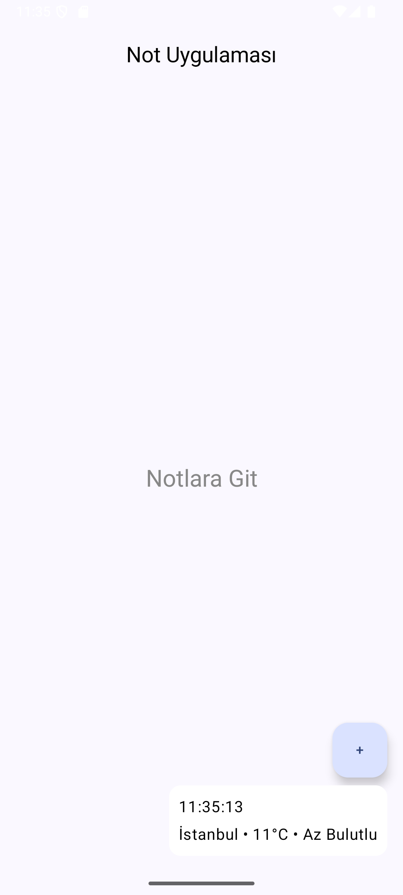
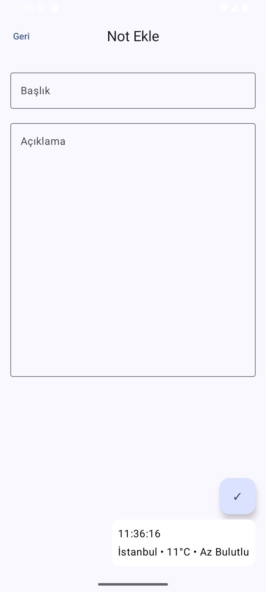
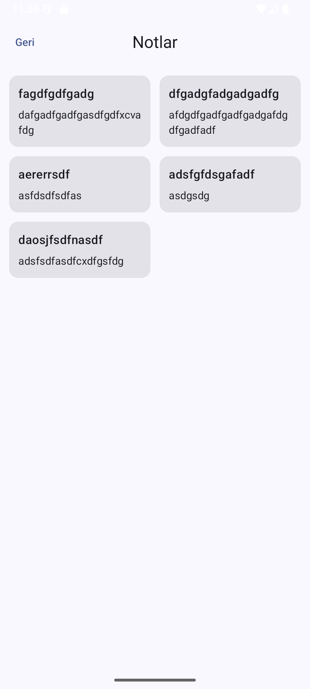
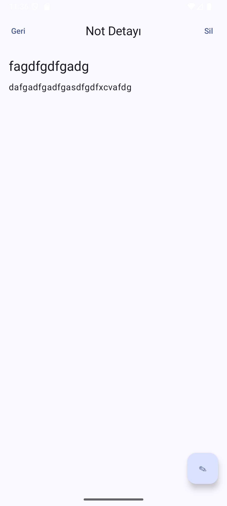

# 📱 Not Uygulaması

Jetpack Compose ile geliştirilmiş basit bir not alma uygulaması.

## 🛠 Kullanılan Teknolojiler
- Kotlin
- Jetpack Compose
- MVVM
- Room Database
- Navigation
- Coroutines
- Open-Meteo API

---

## 📸 Ekran Görüntüleri

### 🏠 Ana Sayfa

**Özellikler:**
- "Notlara Git" butonu ile not listesine geçiş
- Sağ altta Not Ekle (FAB) butonu
- Hava Durumu ve Saat bilgisi gösterimi

---

### ➕ Not Ekleme

**Özellikler:**
- Yeni not başlığı ve açıklama girişi
- Sağ altta kaydet işlemi (FAB)
- Hava Durumu ve Saat bilgisi gösterimi

---

### 📄 Notlar Kısmı

**Özellikler:**
- Kayıtlı notların listelenmesi
- Her nota tıklanıldığında detay/düzenleme ekranına geçiş

---

### ✏️ Not Düzenleme Kısmı

**Özellikler:**
- Notu güncelleme (Edit Mode)
- Sağ altta düzenleme/kaydet modu açma
- Not silme işlemi (AlertDialog ile)
- Room (Update & Delete işlemleri)